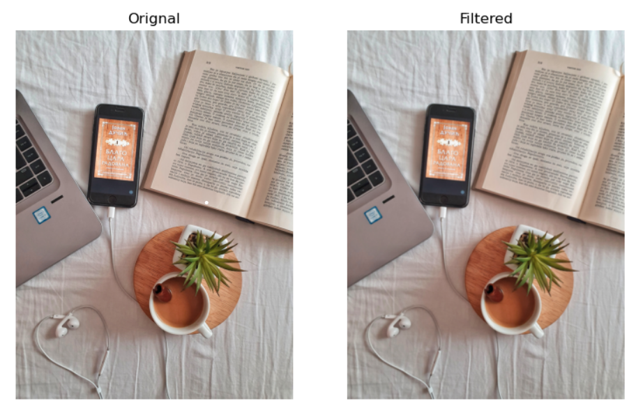
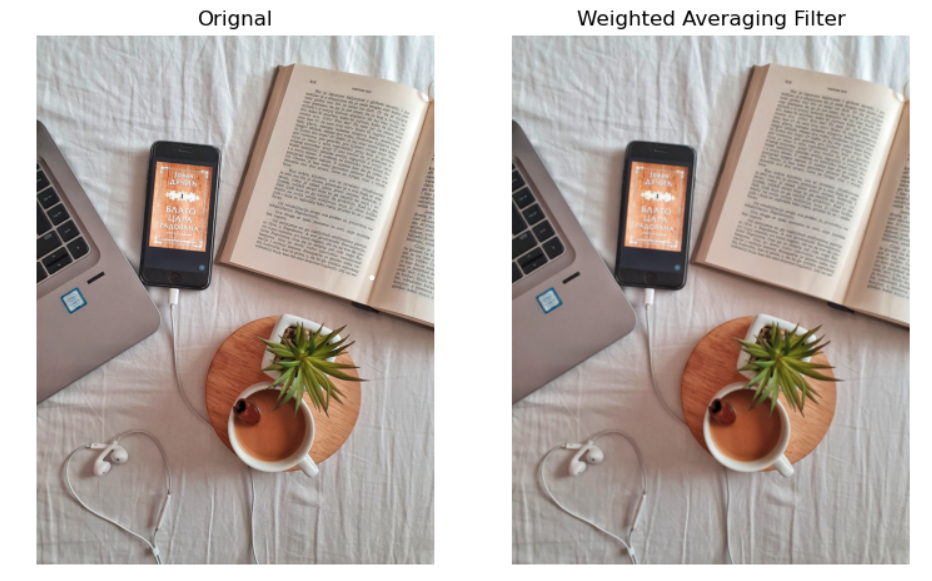
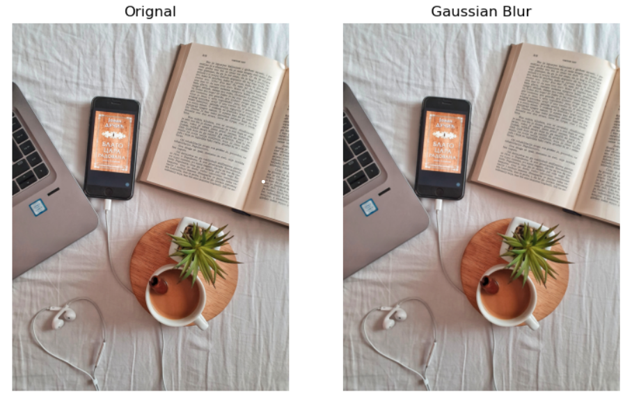
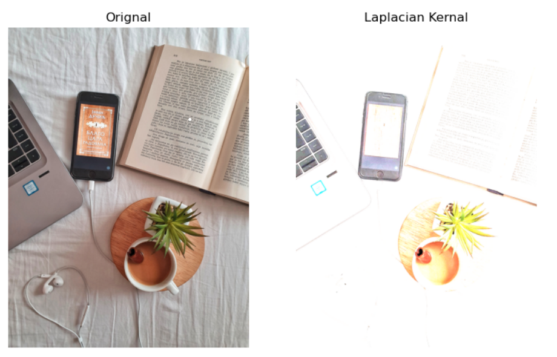
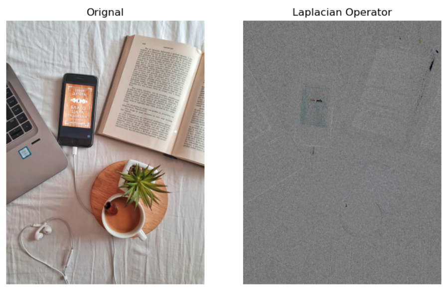

# Implementation-of-Filters
## Aim:
To implement filters for smoothing and sharpening the images in the spatial domain.

## Software Required:
Anaconda - Python 3.7

## Algorithm:
### Step1
Import the necessary modules.

### Step2
Perform smoothing operation on a image.

Average filter(Box Filter)
Weighted average filter
Gaussian Blur
Median filter

### Step3
Perform sharpening on a image.

Laplacian Kernel
Laplacian Operator

### Step4
Display all the images with their respective filters.

## Program:
### Developed By   : Meenakshi M
### Register Number: 212221230057
```py
import cv2
import numpy as np
import matplotlib.pyplot as plt 
```
### 1. Smoothing Filters

### i. Using Averaging Filter
```py
image1=cv2.imread('book.jpg')
image2=cv2.cvtColor(image1,cv2.COLOR_BGR2RGB)
kernel=np.ones((11,11),np.float32)/121
image3=cv2.filter2D(image2,-1,kernel)

plt.figure(figsize=(9,9))
plt.subplot(1,2,1)
plt.imshow(image2)
plt.title('Orignal')
plt.axis('off')

plt.subplot(1,2,2)
plt.imshow(image3)
plt.title('Filtered')
plt.axis('off')
```
### ii. Using Weighted Averaging Filter
```py
kernal2=np.array([[2,2,2],[4,8,4],[2,4,2]])/15
image3=cv2.filter2D(image2,-1,kernel)

plt.figure(figsize=(9,9))
plt.subplot(1,2,1)
plt.imshow(image2)
plt.title('Orignal')
plt.axis('off')

plt.subplot(1,2,2)
plt.imshow(image3)
plt.title('Weighted Averaging Filter')
plt.axis('off')
```
### iii. Using Gaussian Filter
```py
gaussian_blur=cv2.GaussianBlur(src=image2,ksize=(11,11),sigmaX=0,sigmaY=0)

plt.figure(figsize=(9,9))
plt.subplot(1,2,1)
plt.imshow(image2)
plt.title('Orignal')
plt.axis('off')

plt.subplot(1,2,2)
plt.imshow(gaussian_blur)
plt.title('Gaussian Blur')
plt.axis('off')
```

### iv. Using Median Filter
```py
median=cv2.medianBlur(src=image2,ksize=7)

plt.figure(figsize=(9,9))
plt.subplot(1,2,1)
plt.imshow(image2)
plt.title('Orignal')
plt.axis('off')

plt.subplot(1,2,2)
plt.imshow(median)
plt.title('Median Blurring')
plt.axis('off')
```

### 2. Sharpening Filters
### i. Using Laplacian Kernal
```py
kernel3=np.array([[1,2,1],[1,-5,1],[2,1,0]])
image3=cv2.filter2D(image2,-1,kernel3)

plt.figure(figsize=(9,9))
plt.subplot(1,2,1)
plt.imshow(image2)
plt.title('Orignal')
plt.axis('off')

plt.subplot(1,2,2)
plt.imshow(image3)
plt.title('Laplacian Kernal')
plt.axis('off')
```
### ii. Using Laplacian Operator
```py
new_image=cv2.Laplacian(image2,cv2.CV_64F)

plt.figure(figsize=(9,9))
plt.subplot(1,2,1)
plt.imshow(image2)
plt.title('Orignal')
plt.axis('off')

plt.subplot(1,2,2)
plt.imshow(new_image)
plt.title('Laplacian Operator')
plt.axis('off')
```
## OUTPUT:
### 1. Smoothing Filters

### i. Using Averaging Filter


### ii. Using Weighted Averaging Filter


### iii. Using Gaussian Filter


### iv Using Median Filter


### 2. Sharpening Filters

### i. Using Laplacian Kernal


### ii. Using Laplacian Operator


## Result:
Thus the filters are designed for smoothing and sharpening the images in the spatial domain.
